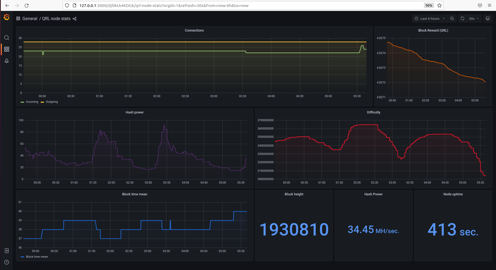
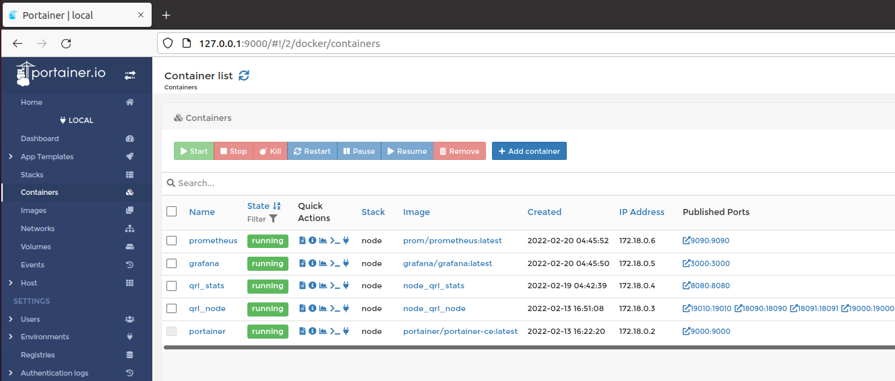
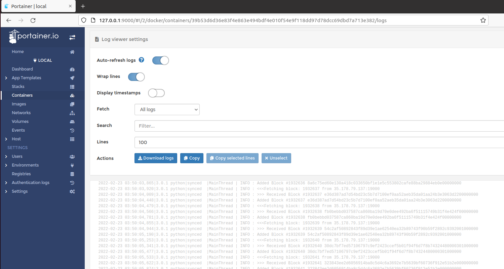

# QRL docker node with monitoring (for Linux or Windows)

Running a [QRL](https://www.theqrl.org/) node strengthens the network, supports the decentralization and further verifies transactions on the network. 

The aim of this project is to run a QRL node in docker with monitoring tools. 

Bootstrap files can help to speed up the syncing process. This project provide an option to setup a node using bootstrap files. 

This project leverages [Portainer](https://www.portainer.io/), [Prometheus](https://prometheus.io/docs/introduction/overview/) and [Grafana](https://grafana.com/). Monitoring code is based on [monerod_exporter](https://github.com/ExcitableAardvark/monerod_exporter).

## Docker node setup

### Windows 10 setup

1) Install [Docker Desktop](https://desktop.docker.com/win/main/amd64/Docker%20Desktop%20Installer.exe) and reboot. 

2) Download this repo (download as zip or clone it). 

3) Run Install_qrl_node_docker.bat as Administrator.

		C:\QRL_docker>Install_qrl_node_docker.bat

	Optional: Use this command to setup a node using a [QRL bootstrap](https://qrl.co.in/).
	
		C:\QRL_docker>Install_qrl_node_docker.bat --bootstrap 

### Ubuntu 20.04 setup

1) Download this repo (download as zip or clone it). 

2) Make the installation script executable.

		$ chmod +x Install_qrl_node_docker.sh	 

3) Run the script (requirements are installed automatically).

	    $ ./sudo Install_qrl_node_docker.sh

	Optional: Use this command to setup a node using a [QRL bootstrap](https://qrl.co.in/).
	
		$ ./sudo Install_qrl_node_docker.sh --bootstrap 

## Node monitoring

For grafana dashboard, navigate to http://localhost:3000. Select the *QRL node stat* dashboard (if you are on the home page, click on *General* to find the QRL dashboard). You will need to wait a couple of minutes after the setup before getting data on the dashboard.

  

## Containers management

Docker containers can be managed using [Portainer](https://www.portainer.io/). After the setup, navigate to http://127.0.0.1:9000. To get the containers, click on *Home*, *local* and then on *Containers*.

  

  

Portainer can be useful for:

- [Stop and restart containers](https://docs.portainer.io/v/ce-2.11/user/docker/containers/view)
- [View container logs](https://docs.portainer.io/v/ce-2.11/user/docker/containers/logs) 
- [Access a container's console](https://docs.portainer.io/v/ce-2.11/user/docker/containers/console)

 

